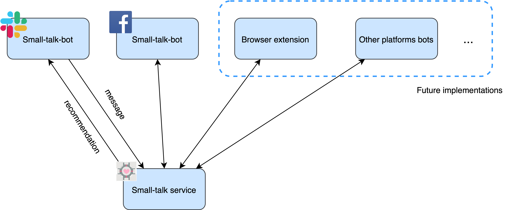
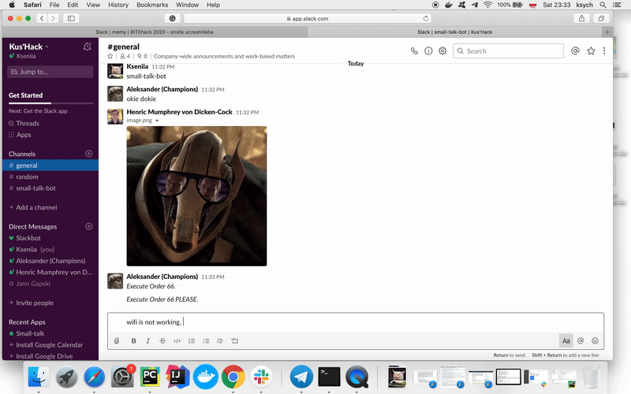

# Small talk bot
 
 Communication is one of the major factor of teams productivity. Our application targeting a wide range of people from diagnosed Asperger syndrome to people who just feel awkward and lost in conversation. So we decided to create a recommendation system that would analyze user's message and send him suggestions on how to enhance it. 
 Examples:
 - emotion detection for people with low level of empathy
 - recommendation of using 'please' for request
 ```
 "Can I take it?" -> "Can I take it? Please"
 ```
 - suggestions with smalltalk phrases like 'how are you?' 'how was your holidays?' 'what's new?'
 - in extreme cases - sarcasm and irony detection
 
 On contrary, there are people who happen to be overreacting and putting to 'emotional' words which might actually de demotivating and stressful for coworkers.
 Example:
 - recommendation to use less ASAP in a given time range
 - avoid questions like 'when it will be ready - tomorrow morning or evening?'
 
 ## Measuring the emotion coefficient
 To make a conversation easier to handle, we try to measure the "emotion coefficient" by calculating all the lexicon ratings (between -1 and 1) in a given message. In our detector, we used a external python library VaderSentiment. 
 ```
 https://github.com/cjhutto/vaderSentiment
 ```
 Basic examples:
 
 ```
#1
 input:  Super, good job!
 output: {'neg': 0.0, 'neu': 0.124, 'pos': 0.876, 'compound': 0.7959}
         Your message is positive
#2
 input:  It was an awful day!
 output: {'neg': 0.429, 'neu': 0.571, 'pos': 0.0, 'compound': -0.4588}
         Your message is negative
#3
 input:  Nevermind
 output: {'neg': 0.0, 'neu': 1.0, 'pos': 0.0, 'compound': 0.0}
         Your message is neutral

 ```
 
 ## Basic functionality
 - Recommendations on overusing 'pushing' messages (like 'ASAP')
 - Adding a marking of a message's emotional tension (like 'positive:0.5, neutral:0.3, negative: 0.0')
 - Slack bot that send hidden recommendation for user on his message
 - Messenger bot send suggestion for user per message
 
 ## Architecture
 The application consist of RESTful web service and slack bot. Since main functionality is located in service it's easy to extend application by writing new bots for different platforms in any language that suits your need. 
 

 
 ## API
 ```
 url: '/'
 method: 'POST'
 request: '{"from":"Jack", "channel_name":"random", "msg":"Hello, have you done those report?"}'
 reponse: '{
    "suggestions":[
        "Consider adding general question. Example 'How are you?'" ]
        }'
 ```
 ## Demo


